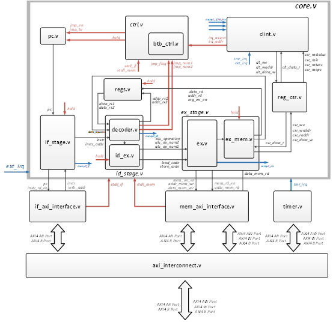

<h1 align = "center">ECNURVCORE RISC-V CPU</h1>
> Design Team：tangyuchao oujiahua liyanzhong liuyuan jiachen

---

## 一、系统整体概述

### (1) 指令集架构

ECNURVCORE是由本团队设计的一个支持RV64I指令集的三级流水线顺序执行CPU。

### (2) 系统对外接口

- 系统具有一个时钟接口：CLK
- 一个高电平有效的复位接口：RESET
- 一个外部中断输入接口：IO_INTERRUPT
- 一组对外用于数据交互的AXI4 master总线，以及一组预留给DMA（暂未实现）的AXI总线接口
  由于对外只有1个master AXI4接口，处理器核内分为取指总线和访存总线两个接口，通过axi_interconnect模块进行仲裁成一个对外的master AXI接口。仲裁时，访存的优先级大于取指的优先级。

#### 以下是接口的详细表格：

| 对外接口  名称  |        |                   |                      |        |                  |
| --------------- | ------ | ----------------- | -------------------- | ------ | ---------------- |
| 时钟            |        |                   | 复位(高电平有效)     |        |                  |
| input           |        | clock             | input                |        | reset            |
| 外部中断        |        |                   |                      |        |                  |
| input           |        | io_interrupt      |                      |        |                  |
| AXI4 Master总线 |        |                   | AXI4 Slave总线(预留) |        |                  |
| input           |        | io_master_awready | output               |        | io_slave_awready |
| output          |        | io_master_awvalid | input                |        | io_slave_awvalid |
| output          | [31:0] | io_master_awaddr  | input                | [31:0] | io_slave_awaddr  |
| output          | [3:0]  | io_master_awid    | input                | [3:0]  | io_slave_awid    |
| output          | [7:0]  | io_master_awlen   | input                | [7:0]  | io_slave_awlen   |
| output          | [2:0]  | io_master_awsize  | input                | [2:0]  | io_slave_awsize  |
| output          | [1:0]  | io_master_awburst | input                | [1:0]  | io_slave_awburst |
| input           |        | io_master_wready  | output               |        | io_slave_wready  |
| output          |        | io_master_wvalid  | input                |        | io_slave_wvalid  |
| output          | [63:0] | io_master_wdata   | input                | [63:0] | io_slave_wdata   |
| output          | [7:0]  | io_master_wstrb   | input                | [7:0]  | io_slave_wstrb   |
| output          |        | io_master_wlast   | input                |        | io_slave_wlast   |
| output          |        | io_master_bready  | input                |        | io_slave_bready  |
| input           |        | io_master_bvalid  | output               |        | io_slave_bvalid  |
| input           | [1:0]  | io_master_bresp   | output               | [1:0]  | io_slave_bresp   |
| input           | [3:0]  | io_master_bid     | output               | [3:0]  | io_slave_bid     |
| input           |        | io_master_arready | output               |        | io_slave_arready |
| output          |        | io_master_arvalid | input                |        | io_slave_arvalid |
| output          | [31:0] | io_master_araddr  | input                | [31:0] | io_slave_araddr  |
| output          | [3:0]  | io_master_arid    | input                | [3:0]  | io_slave_arid    |
| output          | [7:0]  | io_master_arlen   | input                | [7:0]  | io_slave_arlen   |
| output          | [2:0]  | io_master_arsize  | input                | [2:0]  | io_slave_arsize  |
| output          | [1:0]  | io_master_arburst | input                | [1:0]  | io_slave_arburst |
| output          |        | io_master_rready  | input                |        | io_slave_rready  |
| input           |        | io_master_rvalid  | output               |        | io_slave_rvalid  |
| input           | [1:0]  | io_master_rresp   | output               | [1:0]  | io_slave_rresp   |
| input           | [63:0] | io_master_rdata   | output               | [63:0] | io_slave_rdata   |
| input           |        | io_master_rlast   | output               |        | io_slave_rlast   |
| input           | [3:0]  | io_master_rid     | output               | [3:0]  | io_slave_rid     |

### （3）总线地址分配

| **设备**    | **地址空间**      |
| ----------------- | ----------------------- |
| reserve           | 0x0000_0000~0x01ff_ffff |
| CLINT             | 0x0200_0000~0x0200_ffff |
| reserve           | 0x0201_0000~0x0fff_ffff |
| UART16550         | 0x1000_0000~0x1000_0fff |
| SPI控制器         | 0x1000_1000~0x1000_1fff |
| reserve           | 0x1000_2000~0x2fff_ffff |
| SPI-flash XIP模式 | 0x3000_0000~0x3fff_ffff |
| ChipLink MMIO     | 0x4000_0000~0x7fff_ffff |
| memory            | 0x8000_0000~0xffff_ffff |

---

## 二、核内设计

### （一）核内数据流图

### （二）流水线层次

本CPU主要由3级流水线构成，在传统的5级riscv流水线上，合并了取指、访存、写回，实现了**取指**->**译码**->**(执行/访存/写回)** 的一套三级流水线结构

#### 1.取指

本设计的取指过程通过axi总线接口完成，在核内，我们配置了一组组合逻辑来对输入、输出的取指信号进行预处理。

其中，取指的使能信号取决于流水线暂停使能，而在核内的取指单元中，会对pc进行预先的检查：

当pc超出范围或未对齐时，该模块会报告异常，并给出对应的异常原因。

另一方面，考虑到分支预测错误与总线仲裁失利等的影响，当处理器核从总线接口获得指令及其地址时，核内控制单元会向该模块发送指令冲刷使能信号，将被误读的指令用空指令掩盖。

#### 2．解码

本设计的解码模块由一部分组合逻辑与一组流水线寄存器组成，组合逻辑对获取的指令进行解码，而流水线寄存器的输出为执行模块部署输入，如操作数、操作码、访存类型等。

解码器首先对指令进行拆分，将对应段的指令取出，并根据要读取的数据地址，在通用寄存器堆从对应地址处获取执行所需的数据，并根据操作码、功能码来进行数据选择，为ALU分配操作数、操作码。在处理跳转指令时，考虑到要尽可能地减少跳转与指令冲刷带来的时序损失，会把跳转指令的相关信息在解码后直接通过组合逻辑送入控制模块处理。

#### 3．执行

本设计的执行模块由一部分组合逻辑与一组流水线寄存器组成，其中，计算结果和访存指令同时进行处理。其中，执行的组合逻辑部分由一组数据选择器构成，可以根据解码器给出的操作码对各种运算指令的结果进行选择。

#### 4．访存

本设计的访存过程与执行过程同时进行，且均位于执行模块内。在解码阶段，系统通过读取指令获得对应的访存指令类型，用load code/store code的形式传至执行模块的访存部分，生成对应的地址、数据与使能信号，交由AXI接口转为符合AXI4协议的输出，通过AXI总线访问内存。

#### 5．回写

回写指的是cpu运算过程中产生的结果，写回寄存器的过程。本设计中的回写过程紧接着执行模块后的流水线寄存器，通过一个数据选择器来判断写入寄存器堆的数据来源，在这里，写入的数据可以来自ALU的计算结果，也可以来自总线的访存结果。同时，回写过程也会对写入数据、写入地址、写入使能进行缓存，在一个时钟后对寄存器堆进行写入。

### （三）流水线控制逻辑

#### 1.流水线指令生成

本设计中的程序计数器由一个多路选择器和一个寄存器构成，当流水线暂停或总线正忙而无法进行取指时，pc会保持不变；当发生跳转时，跳转使能信号拉高，并将pc直接置为目的地址，进而完成跳转，其中，跳转的原因可能是跳转指令，或者发生了待处理的中断或异常，跳往中断处理函数。

#### 2.流水线的暂停

本设计中各模块的流水线寄存器及状态机由一个使能信号控制，当该使能信号有效时，才能够更新流水线。本设计的流水线暂停是通过控制该使能信号的生成逻辑，让各寄存器保持不变。在暂停过程中，组合逻辑会继续运算，并在使能信号有效前提前准备好要写入的数据。

#### 导致流水线暂停的来源可能有如下几种原因：

##### [1] 取指等待
>当cpu进行取指时，可能无法在一个周期后就马上获得指令，在本设计中，用一个指示位来标识由取值等待导致的流水线暂停。由于本设计没有实装cache，所有指令都通过总线取得，因此该指示位由取值的AXI接口提供。

##### [2] 访存等待
>当cpu进行访存时，需要通过AXI总线与内存交互，其中需要先在地址通道完成握手，再在数据通道完成数据交互，并发出或接收应答信号。在这个过程中，为保证cpu内寄存器堆的数据正确性，需要等待访存结束才能继续运行，在本设计中，用一个指示位来标识由访存等待导致的流水线暂停，该指示位由访存的AXI接口提供。

#### 3.流水线的冲刷
当cpu进行跳转、处理中断、分支预测错误时，可能会取出不需要被执行的指令,这种情况下，需要对流水线进行冲刷。在本设计中，冲刷流水线的行为主要体现于将当前的指令屏蔽为一条空指令，考虑到流水线后方还有尚未执行的指令，因此只在取指阶段对取回的指令进行操作。因此，本设计中的流水线冲刷主要针对单条指令设置了mask信号，从而不执行取回的指令。

### （四）分支预测逻辑
本设计中为cpu的控制模块配置了分支预测逻辑，采用二级动态分支预测，根据BTB(Branch Target Buffer)中缓存的pc和目标地址进行比较，在pc生成后就立刻送入控制模块进行比较。

当接下来要被解码的指令pc符合BTB中预先存储的pc时，控制模块会给出跳转使能，并在下一个时钟校对跳转使能与跳转目标的正确性。当分支预测错误时，会再次触发跳转使能，并跳回正确的pc，同时，动态分支预测单元的状态机会进行切换，此时，由于跳转到了错误的pc，因此需要进行一次指令冲刷。

由于AXI总线在取指时实际上需要至少两个系统时钟(ar通道握手，r通道握手)才能返回指令，因此，本设计中的分支预测逻辑在大部分情况下不需要进行工作。

### （五）LSU单元设计

---

## 二、AXI系统总线设计

为与AXI总线完成数据交互，本设计对cpu的输入输出端口进行了转接处理，其中主要分为接口转换、AXI互联两部分。本设计中，先根据AXI总线的协议对cpu的端口进行转换，再在总线上进行互联，并给出接往内存等外部设备的AXI接口。

### （一）Core-AXI接口转换

本设计中需要进行接口转换的信号一共可以分为两组，分别来自取指阶段和访存阶段，其中，每组信号都包含访问的地址、数据，以及一系列使能信号。这两个接口的行为基本相似，由于功能不同而略微存在差异。

#### 1．取指接口

本设计的取指接口负责按cpu发出的取指使能脉冲向AXI总线的对应地址进行读取，由于AXI总线的字长为64位，因此实际取出的数据为64位，而RV64I指令集中的指令为32位，所以从接口返回cpu的指令为取得数据的前半段或后半段。

由于在取指阶段仅会对总线进行读取，而不会写入，因此该接口只会在AR通道与R通道上进行数据交互。本设计在接口内配置了一个状态机，表示接口目前的等待状态。当cpu发出取指请求时，取值接口使能arvalid，表示此时给出的读取地址有效，等待从机给出arready信号完成握手（arready先于arvalid有效的场合，直接完成握手，那之后，直接进入下一个状态）；在AR通道握手成功后，接口开始等待R通道数据返回，直到总线返回有效数据，并给出rvalid信号，取指接口再次回到空闲状态。

当取回数据后，会根据取指时的地址区分取高32位或低32位，并把该指令缓存在接口内，当该次传输结束后，接口会向cpu保持这条指令内容的输出，以便进行后续的译码与执行阶段。

由于需要等待总线完成取指，因此，取指接口不在空闲状态下时，流水线都会处于暂停状态。同时，考虑到该接口处的取指需要持续进行，因此取指端的rready默认为有效。

#### 2．访存接口

本设计的访存接口负责将cpu发出的访存请求执行，cpu根据读取的指令发布读取或写入的地址与数据(如果有的话)，同时会发布使能信号。由于访存时存在以64位、32位、16位、8位四种不同字长的数据访问，因此，对地址的对齐要求和数据的具体位置需要进行具体调整。以读取16位数据的指令(LH)为例，若读取的数据位于64位数据的高16位(根据访问地址确认)，则会在读取回数据后右移48位将数据的最低位对齐，高位依照指令要求进行逻辑或算数补齐。当进行数据写入时，与上例相似，会根据写入的地址和字长对wstrb进行移位调整，保证写入数据的正确性。

本接口内置了读写两个状态机，分别处理两种行为模式下的与取指接口类似。在进行读取时，先根据使能信号脉冲生成arvalid，

### （二）AXI互联

#### 1．读写机制

#### 2．总线仲裁

## 三、异常与中断处理

本设计中，系统包含以下异常/中断来源，当下列任一中断/异常产生时，CPU将跳转到mtvec所指向的中断处理函数中：

- 外部中断

  外部中断预留给片外实现的外设中断，用于实现一些额外功能，比如可作为外部按键中断输入。

- 定时器中断

  定时器中断来源于片内axi接口上的timer定时器，该定时器拥有两个可配置寄存器：mtime与mtimecmp。mtime寄存器中的值每个时钟边沿固定+1，当mtime寄存器大于等于mtimecmp寄存器时，定时器中断为高，仅可通过配置mtimecmp寄存器清除该中断信号。

- 环境调用异常（ECALL)

  环境调用异常来源于程序中的ecall指令，该指令会触发cpu进入到中断处理函数中、

- 取指异常

  在cpu取指时，若取指地址与指令的不对齐时（如单数地址等），会产生取指异常，指示当前指令取指阶段出现了错误。

- 译码异常

  在cpu译码时，若未命中任一有效指令格式，会产生译码异常，指示当前指令译码阶段出现了译码错误。

- 执行（访存）异常

  在cpu执行时，如果产生了对mem的访存，若访存地址与指令的不对齐时（如单数地址等），会产生执行（访存）异常，指示当前指令执行阶段出现了错误。

## 四、程序编译与仿真环境介绍

## 五、性能测试与成果展示

